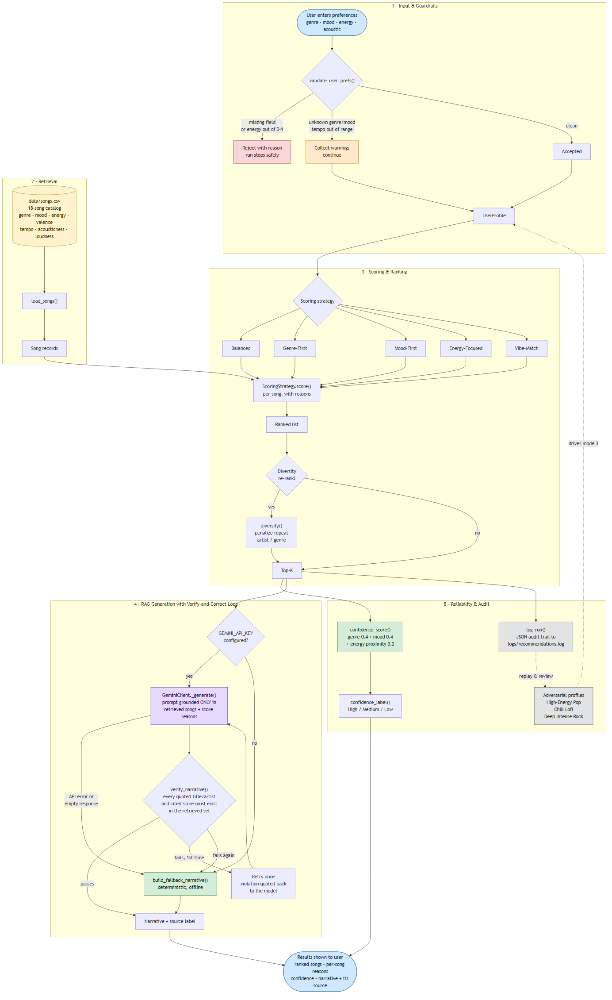

# MoodMatch — An Explainable Music Recommender

A recommendation system that does not just rank songs, but tells you **how much
to trust the ranking** — and verifies its own AI-generated explanations before
showing them to you.

---

## Summary

MoodMatch takes a listener's stated taste — genre, mood, energy level, acoustic
preference — and returns five ranked songs, each with a plain-English breakdown
of why it scored where it did. It then generates a natural-language narrative
about the playlist as a whole, and **checks that narrative against the songs it
actually retrieved** before displaying it. If the language model names a song
that was never in the results, the system catches it, asks for a correction,
and discards the output entirely if the correction fails.

**Why this matters.** Most recommenders present five results identically
whether they nailed your taste or barely matched it. That silence is the
problem: a user has no way to distinguish a great match from the best of a bad
set. MoodMatch reports a confidence score with every result, and when it cannot
serve a listener well, it says so. The same principle drives the verification
layer — an AI explanation that sounds fluent but cites a song that does not
exist is worse than no explanation, because it is confidently wrong.

---

## The Original Project

This system extends **Module 3 — Music Recommender Simulation**.

The original was a command-line prototype that represented songs and a user
taste profile as structured data, then applied a hand-written scoring rule to
rank them. Its goals were to design a transparent scoring formula, produce
recommendations with a human-readable reason string for each pick, and evaluate
where the system's logic broke down. It had no AI integration, no input
validation, no measure of its own output quality, and no way to run
interactively — a single `main()` printed a fixed set of hardcoded profiles.

**What version 2.0 adds:**

| Capability | v1.0 | v2.0 |
|---|---|---|
| Interactive CLI | No — hardcoded profiles only | Three modes, live user input |
| Input validation | None | Rejects invalid input, warns on unknown values |
| Output quality signal | None | Confidence score, High/Medium/Low |
| AI generation | None | RAG narrative grounded in retrieved songs |
| Hallucination handling | N/A | Verify → correct → fall back |
| Audit trail | None | Structured JSON log per run |
| Tests | 2 (both failing) | 70, all passing |

---

## Architecture Overview



Mermaid source: [`diagrams/architecture.mmd`](diagrams/architecture.mmd)

The system runs in five stages:

**1 — Input and guardrails.** User preferences hit `validate_user_prefs()`
before anything else. Unrecoverable problems (a missing field, an energy value
outside 0–1) stop the run with a specific reason. Soft problems (an unknown
genre, an out-of-range tempo) produce a warning, and the run continues with the
warning recorded.

**2 — Retrieval.** The song catalog loads from `data/songs.csv` with numeric
fields cast to their proper types.

**3 — Scoring and ranking.** Every song is scored against the profile by one of
five interchangeable strategies. Each scoring decision appends a
human-readable reason, so the explanation is a byproduct of the scoring rather
than a separate narrative bolted on afterward. An optional greedy re-rank
penalizes repeated artists and genres.

**4 — RAG generation with a verify-and-correct loop.** The top-k results — and
only those — are handed to the narrative generator. The output is verified
against that same retrieved set. A failure triggers one corrective retry; a
second failure falls back to a deterministic generator. This is the only stage
with a cycle in it, and that cycle is the point: the model checks its own work.

**5 — Reliability and audit.** Confidence scoring, JSON logging, and the
adversarial evaluation profiles that drive mode 3.

The critical design property is that **stage 4 can never introduce information
that did not come from stage 2**. The generator never sees the catalog, only
the retrieved subset.

---

## Setup

**Requires Python 3.9 or newer.**

```bash
git clone https://github.com/yohanakatani/applied-ai-system-final.git
cd applied-ai-system-final
pip install -r requirements.txt
```

Run it:

```bash
python -m src.main
```

Run the tests:

```bash
pytest
```

Verified from a clean clone with no `.env` and no network access: **70 passed**.
The full test suite exercises the LLM correction loop using scripted model
responses, so nothing requires an API key or an internet connection.

### Optional — enable AI narrative generation

**The system runs fully without an API key.** Narrative mode falls back to a
deterministic offline generator, and every test passes without network access.
A key only upgrades narrative quality from template-generated to LLM-generated.

To enable it:

1. Get a free Gemini API key at <https://aistudio.google.com/apikey>
2. Create a `.env` file in the project root:

```
GEMINI_API_KEY=your_key_here
```

Optionally pin a specific model:

```
GEMINI_MODEL=gemini-2.0-flash
```

**On free-tier quotas.** The free tier limits requests per minute *and* per day,
and the daily cap is enforced **per model**. If `gemini-2.0-flash` returns
`429 RESOURCE_EXHAUSTED` with `GenerateRequestsPerDayPerProjectPerModel`,
waiting will not help until the daily reset — but switching `GEMINI_MODEL` to a
different model draws on a separate daily bucket. Verified working during
development: `gemma-4-26b-a4b-it`.

`.env` is gitignored, so keys are never committed.

---

## Sample Interactions

All transcripts below are real output from the current code.

> **A note on the scores.** The same song scores differently depending on how
> many preferences were supplied, because the score is a sum over whichever
> signals the profile activates. The interactive CLI asks for four preferences
> (genre, mood, energy, acoustic), so "Library Rain" scores **4.50** in Example
> 1. The built-in evaluation profiles in Example 5 specify eleven — adding
> valence, tempo, popularity, decade, detailed mood tag, and loudness — so six
> more signals fire and the same song scores **9.86**. Scores are comparable
> *within* a result set, which is all the ranking needs; they are not on a
> fixed scale across profiles.

### Example 1 — A request the catalog can serve well

**Input:** genre `lofi`, mood `chill`, energy `0.35`, acoustic `y`

```
============================================================
Top 5 recommendations  |  Confidence: Medium (67%)
============================================================
  Library Rain by Paper Lanterns
    Genre: lofi  Mood: chill  Energy: 0.35
    Score: 4.50  |  Because: Genre match: lofi; Mood match: chill;
                             Energy score: 1.00; Acoustic preference match

  Midnight Coding by LoRoom
    Genre: lofi  Mood: chill  Energy: 0.42
    Score: 4.43  |  Because: Genre match: lofi; Mood match: chill;
                             Energy score: 0.93; Acoustic preference match

  Focus Flow by LoRoom
    Genre: lofi  Mood: focused  Energy: 0.40
    Score: 2.95  |  Because: Genre match: lofi; Mood mismatch: focused;
                             Energy score: 0.95; Acoustic preference match

  Spacewalk Thoughts by Orbit Bloom
    Genre: ambient  Mood: chill  Energy: 0.28
    Score: 2.43  |  Because: Mood match: chill; Energy score: 0.93;
                             Acoustic preference match

  Coffee Shop Stories by Slow Stereo
    Genre: jazz  Mood: relaxed  Energy: 0.37
    Score: 0.98  |  Because: Mood mismatch: relaxed; Energy score: 0.98;
                             Acoustic preference match
```

Note how the list degrades legibly. The top two match genre *and* mood. Third
is the right genre, wrong mood. Fourth is the right mood, wrong genre. Fifth
matches neither and is carried entirely by energy proximity and the acoustic
bonus — and the 3.5-point score gap makes that visible without reading the
reasons.

### Example 2 — A request the catalog *cannot* serve well

**Input:** genre `rock`, mood `intense`, energy `0.9`, acoustic `n`

```
============================================================
Top 5 recommendations  |  Confidence: Low (43%)
============================================================
  Storm Runner by Voltline
    Genre: rock  Mood: intense  Energy: 0.91
    Score: 3.99  |  Because: Genre match: rock; Mood match: intense;
                             Energy score: 0.99

  Gym Hero by Max Pulse
    Genre: pop  Mood: intense  Energy: 0.93
    Score: 1.97  |  Because: Mood match: intense; Energy score: 0.97

  Neon Jungle by BVSSLINE
    Genre: hip-hop  Mood: energetic  Energy: 0.87
    Score: 0.47  |  Because: Mood mismatch: energetic; Energy score: 0.97
```

**This is the system working correctly.** The catalog contains exactly one rock
song, so after position one there is nothing left to serve this listener. A
recommender without a confidence score would present this list exactly as it
presented Example 1. Here the `Low (43%)` label tells the user the truth
up front.

### Example 3 — Narrative generation

**Input:** same as Example 1, run in mode 2

This is the output from a **fresh clone with no API key configured** — what you
will see if you follow the setup steps above and skip the optional key:

```
Playlist Narrative:
------------------------------------------------------------
This 5-song playlist is led by "Library Rain" by Paper Lanterns, the
strongest match at a score of 4.50. 3 of 5 picks are actually in your
preferred lofi genre. 3 carry the chill mood you asked for. The average
energy of 0.36 sits right on your 0.35 target. Be aware the tail of the
list is weaker: "Coffee Shop Stories" scored only 0.98 and is a loose fit.

[generated by: template]
```

The `[generated by: ...]` tag is always present, and it distinguishes *why*
the template was used. With no key configured the tag reads `template`. With a
key that fails at request time it names the failure instead:

```
[generated by: template (API error: ClientError)]
```

The system never passes template output off as model output, and it never
hides the reason it fell back.

**With a working API key**, the same request produces an LLM narrative that has
passed verification:

```
This selection prioritizes your request for lofi and chill vibes, anchored by
"Library Rain" by "Paper Lanterns" which earned a score of 4.50. You will also
hear "Midnight Coding" by "LoRoom", which matches your energy needs with a
score of 4.43. Although "Focus Flow" by "LoRoom" has a mood mismatch, it
remains in the mix because it meets the lofi genre and acoustic preference.
This playlist works best for a calm afternoon of studying or relaxing.

[generated by: gemini:gemma-4-26b-a4b-it (verified (6 entities, 2 scores))]
```

Every quoted name and both cited scores were checked against the retrieved
songs before this was displayed. The model also volunteered the mood mismatch
on "Focus Flow" rather than glossing over it.

### Example 4 — Guardrails catching bad input

**Input:** genre `polka`, mood `smug`, energy `0.5`

```
Warnings:
  ! Unknown genre 'polka'. Known genres: ambient, classical, edm, folk,
    hip-hop, indie pop, jazz, lofi, metal, pop, r&b, rock, synthwave.
    Results may be sparse.
  ! Unknown mood 'smug'. Known moods: aggressive, angry, chill, dreamy,
    energetic, euphoric, focused, happy, intense, moody, nostalgic, relaxed.
    Results may be sparse.

Top 5 recommendations  |  Confidence: Low (18%)
```

Unknown values warn rather than crash, and the resulting 18% confidence
correctly reflects that nothing in the catalog matched. Hard errors behave
differently — entering `99` for energy stops the run:

```
Invalid input: target_energy must be a number between 0.0 and 1.0, got: 99.0
```

### Example 5 — Reliability report (mode 3)

```
Profile: High-Energy Pop
  Confidence: Medium (51%)
  Top pick: Sunrise City by Neon Echo (score 9.14)

Profile: Chill Lofi
  Confidence: Medium (67%)
  Top pick: Library Rain by Paper Lanterns (score 9.86)

Profile: Deep Intense Rock
  Confidence: Low (43%)
  Top pick: Storm Runner by Voltline (score 9.21)

------------------------------------------------------------
Summary:
  High-Energy Pop        Medium   51%  ##########
  Chill Lofi             Medium   67%  #############
  Deep Intense Rock      Low      43%  ########
```

---

## Design Decisions

### Confidence scoring over silent ranking

**Decision:** report a 0–1 confidence score with every result set.

**Why:** the original system's most serious flaw was not bad rankings — it was
presenting a rock listener's five results with exactly the same confidence as a
lofi listener's, when it could genuinely serve one and not the other. Ranking
quality was invisible.

**Trade-off:** the score is a heuristic (40% genre agreement, 40% mood, 20%
energy proximity), not a calibrated probability. It measures agreement with the
stated profile, not predicted enjoyment. A listener who describes their taste
inaccurately gets a confident playlist they dislike. I accepted this because an
imperfect quality signal beats none at all.

### Verification over trusting the prompt

**Decision:** mechanically check LLM output against the retrieved songs.

**Why:** an earlier version of this project had a prompt reading "do not invent
songs" and documentation claiming the narrative was grounded. It was not — it
was *requested* to be grounded, which is a different claim, and nothing could
tell the difference. An instruction you cannot verify is a hope.

**Trade-off:** making the check reliable required constraining the prompt —
double quotes are now reserved for song titles and artist names only, so any
other quoted string is a fabrication rather than a judgment call. If the model
quotes a phrase for emphasis anyway, verification fails and the system falls
back to the template even though nothing was invented. I chose that direction
deliberately: a needless fallback costs some narrative quality, while a missed
fabrication costs the user's trust.

### Graceful degradation over hard dependency

**Decision:** the system runs fully without an API key.

**Why:** this began as a workaround. The API key inherited from a previous
module turned out to be dead, and the first end-to-end run returned a 401 error
string where a narrative should have been. Building an offline generator was
the fix. Later runs on a working key hit free-tier daily quota limits, which
turned the workaround into the more important half of the design — credential
problems are not the only way an API becomes unavailable.

**Trade-off:** two generators means two code paths to maintain and test. In
exchange, anyone can clone the repo and get a working system with no
credentials, the entire test suite runs without network access, and an API
outage degrades quality instead of breaking the feature. The
`[generated by: ...]` tag makes the difference visible rather than hiding it.

### Explanations as a byproduct of scoring

**Decision:** build the reason string inside the scoring function.

**Why:** the alternative — generating an explanation after the fact — allows
the explanation to drift from the actual computation. Appending each reason at
the moment its points are awarded makes divergence structurally impossible.

**Trade-off:** the reason strings read mechanically ("Energy score: 0.93")
compared to what a language model would write. That is exactly why the LLM
narrative layer exists on top: the machine-generated reasons are the ground
truth, and the narrative is a readable summary of them that gets verified
against the same data.

---

## Testing Summary

`pytest` — **70 tests, all passing**, no network access required.

| File | Covers |
|---|---|
| `test_recommender.py` | Ranking order, explanation generation |
| `test_guardrails.py` | Validation boundaries, confidence math, label thresholds |
| `test_narrative.py` | Narrative grounding, honesty about weak picks, API-failure fallback |
| `test_verifier.py` | Quote and score extraction, fabrication detection, correction loop |
| `test_logger.py` | Audit format, append behavior, timezone-aware timestamps |

### What worked

**The verify-and-correct loop.** Driven with scripted model responses, all four
paths behave correctly:

| Model behavior | API calls | Outcome |
|---|---|---|
| Stays grounded | 1 | Accepted, `verified (2 entities, 0 scores)` |
| Names "Purple Rain", then corrects | 2 | Accepted, `after 1 correction` |
| Names "Bohemian Rhapsody" twice | 2 | Rejected, template, violation named |
| Cites a fabricated score of 9.99 | 2 | Rejected, `unsupported scores: 9.99` |

In both failing cases the fabricated song is absent from what the user sees.

**Guardrails.** No tested input produced an unhandled exception — including
non-numeric energy, out-of-range values, missing fields, and unknown
genres and moods.

### What didn't work

**Both inherited tests were failing.** The `Song` dataclass required three
fields the test file did not supply, so the suite could not construct a `Song`
at all. This had been broken and unnoticed.

**The CLI crashed on Windows.** A `UnicodeEncodeError` on box-drawing
characters under `cp1252` killed the evaluation report mid-print. Anyone
cloning the repo on Windows would have hit it immediately. Fixed by forcing
stdout to UTF-8.

**The API key was dead.** Not a wrong model name or a quota issue — a `401`
at the authentication layer, on both a generation call and a bare
list-models call.

**My diagnosis of *why* it was dead was wrong.** I concluded from the key's
`AQ.` prefix that it was an expired OAuth token rather than an API key, and
wrote that into the documentation as established fact. It is not: `AQ.` is
Google's current API key format from AI Studio. The key was simply revoked or
invalid. The evidence contradicting me was already in hand — a later `AQ.` key
authenticated and listed 58 models — and I restated the claim anyway before
noticing. Corrected across the README, model card, and interaction log.

**Two features turned out to be nearly inert.** Running the Deep Intense Rock
profile through all five scoring strategies produced **three distinct orderings
but exactly one distinct set of songs**, at identical 43% confidence. Diversity
re-ranking changed nothing for two of three profiles. Both trace to catalog
sparsity: with 18 songs, the strategies have nothing to choose between.

**"High" confidence is unreachable.** Sweeping all 13 genres × 12 moods at k=3
and k=5 — 312 combinations — exactly **one** reached High. The largest
genre-and-mood pair in the catalog is two songs, so a request for five results
must pad positions 3–5 with partial matches.

### What I learned

Testing is worth more when it measures the property you actually care about
than when it measures the thing that is easy to assert. Checking that the
scoring strategies produced different *orderings* would have passed and told me
nothing. Checking whether they produced different *sets* revealed that the
largest feature carried over from the original project barely functions at this
catalog size. The code was correct; my assumption about what it accomplished
was not.

The corollary is that running the system beats reasoning about it. Every
significant bug in this list — the failing tests, the Windows crash, the dead
key, the inert features — was found by execution, not by reading code.

---

## Reflection

The most valuable thing this project added was not the AI narrative. It was the
confidence score, because it converted a silent failure into a visible one. The
original system's rankings were never wrong; the absence of any signal about
ranking *quality* was the actual defect, and it took building the measurement
to see it.

Working on the verification layer changed how I read prompt instructions. I had
written that the narrative was "grounded" when the truth was that grounding had
been requested and never checked — and I could not tell the difference until I
built the check. That gap between an instruction and a guarantee is invisible
from the inside, and closing it required changing the prompt so the guarantee
could be enforced mechanically.

> **Responsible-AI reflection and ethics** is in
> [`model_card.md`](model_card.md), section 8:
>
> - **8.1** Limitations and biases (full analysis in section 6)
> - **8.2** How this system could be misused, and what resists it
> - **8.3** What surprised me while testing reliability
> - **8.4** Collaborating with AI — one helpful suggestion, one flawed
> - **8.5** What the project taught me

---

## Known Limitations

Documented in full in [`model_card.md`](model_card.md).

- **The catalog is 18 songs.** Nine of thirteen genres have exactly one
  representative. This single fact explains why the scoring strategies cannot
  differentiate, why diversity re-ranking has nothing to penalize, and why High
  confidence is unreachable. More songs would fix all three; better math would
  fix none of them.
- **The genre bonus overwhelms mood.** +2.0 for a genre match against −0.5 for
  a mood mismatch means genre wins by 4×, so a wrong-mood song from the right
  genre can outrank a right-mood song from a neighboring one.
- **Mood matching is binary.** "angry" and "intense" are penalized as harshly
  as "angry" and "chill."
- **Verification covers entities, not reasoning.** A narrative naming only real
  songs but describing them inaccurately — calling a valence-0.22 track
  "uplifting" — would pass. Entity grounding is a floor, not a guarantee of
  truthfulness.

---

## Project Structure

```
applied-ai-system-final/
├── assets/
│   └── architecture.png       # Rendered architecture diagram
├── diagrams/
│   └── architecture.mmd       # Mermaid source
├── data/
│   └── songs.csv              # 18-song catalog with audio features
├── src/
│   ├── main.py                # CLI: three modes
│   ├── recommender.py         # Scoring strategies, ranking, diversity re-rank
│   ├── guardrails.py          # Input validation + confidence scoring
│   ├── llm_client.py          # RAG generation + verify-and-correct loop
│   ├── verifier.py            # Grounding checks on generated narratives
│   └── logger.py              # JSON audit trail
├── tests/                     # 70 tests
├── logs/                      # Created on first run (gitignored)
├── model_card.md              # Evaluation, bias analysis, responsible-AI reflection
├── ai_interactions.md         # AI-assisted development log
├── requirements.txt
└── .env                       # Your API key (gitignored)
```

**Built with:** Python 3, pytest, Google Gemini API (`google-genai`),
python-dotenv, Mermaid.
